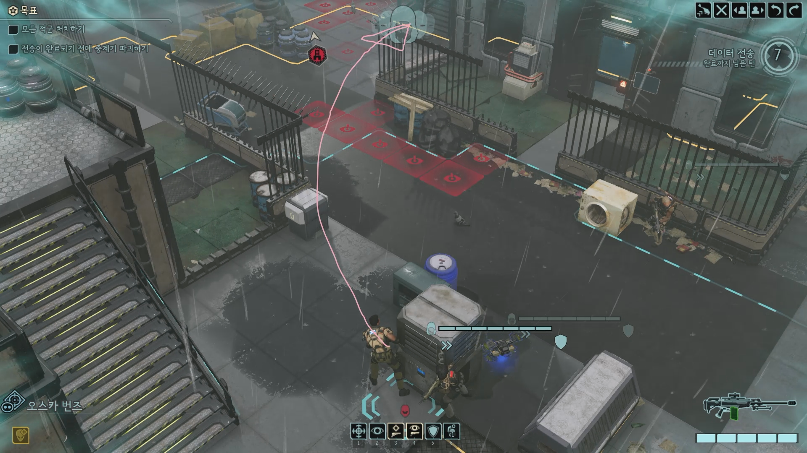
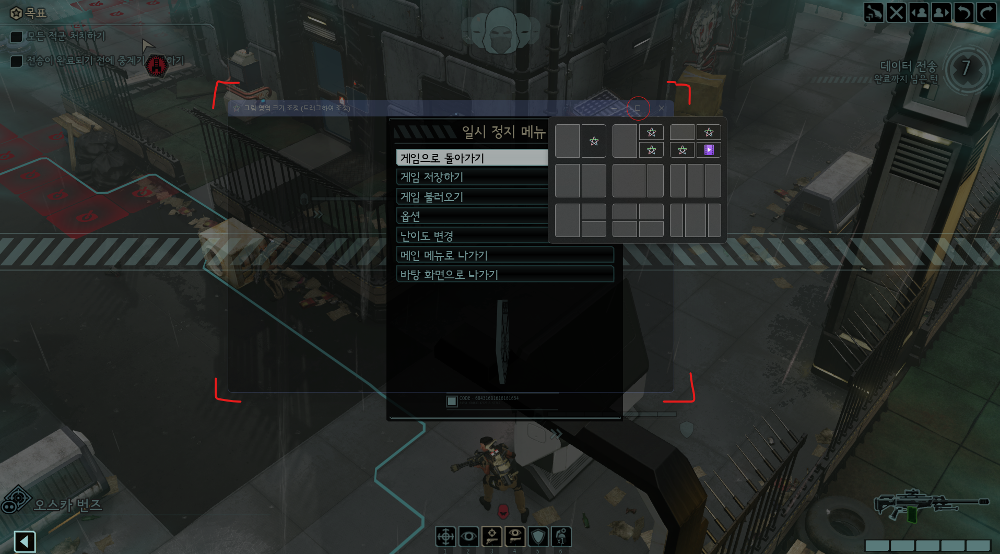

# Screen Party

디스코드 화면공유와 함께 사용해서 실시간으로 그림을 그리는 도구



## 사용 가이드

### 1. 버전 확인

[Releases 페이지](https://github.com/kimkun07/screen-party/releases)에서 사용할 릴리즈를 선택합니다.

- 각 릴리즈마다 호환되는 서버/클라이언트 버전이 명시되어 있습니다.
- 릴리즈 페이지에 표시된 정확한 버전을 사용하세요.

### 2. 서버 준비 (셀프 호스팅)

Docker로 서버를 실행합니다. **릴리즈 페이지에 명시된 서버 버전**을 사용합니다.

```bash
# v1.0.0 릴리즈의 서버 실행 예시
docker run -d -p 8765:8765 kimkun07/screen-party-server:v1.0.0
```

또는 Docker Compose 사용:

```yaml
services:
  screen-party-server:
    image: kimkun07/screen-party-server:v1.0.0  # 릴리즈에 명시된 버전 사용
    ports:
      - "8765:8765"
    restart: unless-stopped
```

```bash
docker compose up -d
```

### 3. 클라이언트 설치

**Windows 실행 파일 다운로드**

1. [Releases 페이지](https://github.com/kimkun07/screen-party/releases)에서 선택한 릴리즈의 `ScreenParty.exe` 다운로드
2. `ScreenParty.exe` 실행

### 4. 호스트: 세션 생성 및 화면공유

1. **Screen Party 실행**
2. **서버 주소 입력 및 세션 생성**
   - 서버 주소 입력 (예: `ws://localhost:8765` 또는 `ws://서버IP:8765`)
   - "세션 생성" 버튼 클릭
   - 메인 화면 진입
3. **세션 코드 복사**
   - 메인 화면에서 6자리 세션 코드 표시 (예: `ABC123`)
   - "복사" 버튼으로 세션 코드 복사
     - 
   - Discord 채팅에 세션 코드 공유
4. **그림 영역 생성**
   - "그림 영역 생성" 버튼 클릭
   - 투명 오버레이가 나타나면 드래그로 크기 및 위치 조정
     - 
   - "그림 영역 크기 조정 완료" 버튼 클릭 또는 `Enter` 키로 완료
5. **화면공유 시작**
   - Discord에서 게임 창 화면공유 시작

### 5. 게스트: 세션 참여

1. **Screen Party 실행**
2. **서버 주소, 세션 코드 입력 및 세션 참여**
   - 호스트와 동일한 서버 주소 입력 (예: `ws://서버IP:8765`)
   - 호스트가 공유한 세션 코드 입력 (예: `ABC123`)
   - "세션 참여" 버튼 클릭
   - 메인 화면 진입
3. **그림 영역 설정**
   - "그림 영역 생성" 버튼 클릭
   - Discord 화면공유의 게임 영역에 맞춰 드래그로 크기 조정
     - TO WRITE - 스크린샷 첨부
   - "그림 영역 크기 조정 완료" 버튼 클릭 또는 `Enter` 키로 완료

### 6. 드로잉 기능

- **그리기 활성화/비활성화**: "그리기 활성화" 버튼 클릭 (또는 `ESC` 키로 비활성화)
- **그리기**: 그리기 활성화 상태에서 마우스 왼쪽 버튼 드래그
- **색상 변경**: 메인 화면의 색상 팔레트에서 색상 선택
- **자동 페이드**: 그린 선은 2초 후 1초 동안 페이드아웃됨

## 개발 환경

### 현재 개발 환경 구성

이 프로젝트는 다음과 같은 **하이브리드 환경**에서 개발하고 있습니다:

- **devcontainer (Linux)**: 개발 진행: 클로드 코드를 bypass permissions on 모드로 실행하기 위한 환경
- **WSL (Ubuntu)**: 프로젝트 저장소 위치, docker engine 설치, devcontainer 실행
- **Windows**: 클라이언트 GUI (PyQt6) 테스트
  - 윈도우에서 Docker Desktop을 이용해 devcontainer를 실행한다면 WSL이 필요없겠지만, 일단 이런 구조입니다

### 환경 구성 방법

#### 1단계: WSL에 프로젝트 클론

```bash
# WSL (Ubuntu) 터미널에서
git clone https://github.com/kimkun07/screen-party.git
cd screen-party
```

#### 2단계: VS Code에서 devcontainer 열기

**devcontainer의 Git Credential 제거**

devcontainer 내부에서 Github 레포지토리를 변경하지 못하도록 로그인 정보를 제거합니다.

1. Windows에서 VS Code 실행
2. VS Code 설정 열기 (`Ctrl + ,`)
3. "dev containers" 검색
4. **Dev > Containers: Copy Git Config** → `false`로 설정
5. **Dev > Containers: Git Credential Helper Config Location** → `none`으로 설정

**devcontainer 열기**
1. Command Palette → `Dev Containers: Open Folder in Container...`
2. WSL 경로 선택: `\\wsl$\Ubuntu\home\username\screen-party`
3. devcontainer가 자동으로 빌드되고 실행됨

#### 3단계: 개발 시작 전 스크립트 실행

개발에 필요한 스크립트들은 `.devcontainer/manual-scripts/`에 있습니다. 각 스크립트 파일 상단의 주석을 복사하여 실행하세요.

**WSL 터미널에서 실행 (필수)**:

**WSL → Windows 동기화** (`start-mirror.sh`)
- WSL 파일 변경을 Windows로 자동 동기화
- Windows에서 클라이언트 GUI 테스트 시 필요
- 백그라운드에서 계속 실행되어야 하므로 별도 터미널 탭에서 실행
```bash
# 스크립트 파일의 주석 참조
# 복사해서 바로 실행 (WSL에서)
# /home/simelvia/Develop-WSL/screen-party/.devcontainer/manual-scripts/start-mirror.sh /mnt/d/Data/Develop/screen-party-mirrored
```

**Windows PowerShell에서 실행 (선택사항)**:

**알림 브릿지** (`start-notify-bridge.ps1`)
- Claude Code 작업 완료를 Windows 알림으로 받기 위한 서버
- Windows 호스트 머신에서 포트 6789로 알림 서버 운영
- devcontainer의 Claude Code가 작업 완료 시 Windows 네이티브 알림 표시
```powershell
# 스크립트 파일의 주석 참조
# 복사해서 바로 실행 (PowerShell에서):
# & "D:\Data\Develop\screen-party-mirrored\.devcontainer\manual-scripts\start-notify-bridge.ps1"
```

**WSL 터미널에서 실행 (개발자 개인용)**:

**개발 편의 서버 시작** (`start-dev-servers.sh`)
- monoserver-private2의 개발 서버 시작 (Happy Server + Screen Party Server)
- Happy Server는 Claude Code 휴대폰 사용을 위한 환경
```bash
# 스크립트 파일의 주석 참조
# 복사해서 바로 실행 (WSL에서)
# /home/simelvia/Develop-WSL/screen-party/.devcontainer/manual-scripts/start-dev-servers.sh
```

#### 4단계: Windows에 uv 및 가상환경 설치

```powershell
# PowerShell
# 1. uv 설치
powershell -ExecutionPolicy ByPass -c "irm https://astral.sh/uv/install.ps1 | iex"

# 2. 동기화된 디렉토리로 이동
cd D:\Data\Develop\screen-party-mirrored

# 3. Windows용 가상환경 생성
uv venv

# 4. 가상환경 활성화
.venv\Scripts\activate.ps1

# 5. 의존성 설치
uv sync --all-groups
```

> **참고**:
> - WSL의 `.venv`와 Windows의 `.venv`는 별도로 관리됩니다

#### 5단계: 사용 가능한 명령어

모든 스크립트는 `uv run` 명령어로 실행합니다:

**클라이언트 명령어**:
```bash
uv run client                    # 클라이언트 실행
uv run package-client <version>  # 클라이언트 패키징 (Windows만 가능)
```

**서버 명령어**:
```bash
uv run server                    # 서버 실행 (로컬)
uv run dockerized-server         # Docker Compose로 서버 실행
uv run publish-server <version>  # Docker 이미지 빌드 및 Docker Hub 배포
```

**개발 도구**:
```bash
uv run format                    # 전체 코드베이스 포맷팅 (Black)
uv run lint                      # 전체 코드베이스 린팅 (Ruff)
uv run test                      # 전체 테스트 실행 (pytest)
```

모든 명령어는 `--help` 옵션으로 자세한 도움말을 볼 수 있습니다:
```bash
uv run server --help
uv run publish-server --help
uv run package-client --help
```

#### 6단계: 배포 워크플로우

**서버 Docker 배포**

프로젝트 루트에서 `uv run publish-server` 명령어를 사용하여 자동으로 빌드 및 배포:

```bash
uv run publish-server v0.1.0          # v0.1.0 태그로 빌드 및 배포
uv run publish-server v0.2.0          # v0.2.0 태그로 빌드 및 배포

# 도움말 보기
uv run publish-server --help

# Dry-run 모드 (실제로 실행하지 않고 명령어만 확인)
uv run publish-server v0.1.0 --dry-run

# latest 태그 푸시 건너뛰기
uv run publish-server v0.1.0 --skip-latest
```

`publish-server` 스크립트가 자동으로 다음 작업을 수행합니다:
1. Docker 이미지 빌드
2. 버전 태그 지정 (예: v0.1.0)
3. latest 태그 추가
4. Docker Hub에 푸시 (v0.1.0 + latest)

**클라이언트 앱 패키징 (Windows)**

PyInstaller를 사용하여 Windows 실행 파일(.exe)을 생성합니다.

> **중요**: Windows 환경에서만 실행 가능합니다.

```powershell
# Windows PowerShell
cd D:\Data\Develop\screen-party-mirrored
.\.venv\Scripts\activate.ps1

# 클라이언트 패키징
uv run package-client v0.1.0

# 도움말 보기
uv run package-client --help

# Dry-run 모드 (실제로 실행하지 않고 명령어만 확인)
uv run package-client v0.1.0 --dry-run
```

`package-client` 스크립트가 자동으로 다음 작업을 수행합니다:
1. 기존 빌드 정리 (build/, dist/)
2. version_info.txt 생성 (Windows 버전 정보)
3. PyInstaller 실행 (client.spec 기반)
4. 임시 파일 정리

결과물:
- `dist/ScreenParty.exe` - 실행 파일 (단일 파일, ~100-200MB)

**GitHub Release 배포**:

1. GitHub 레포지토리 → Releases → Create a new release
2. Tag: v0.1.0 입력 및 생성
3. Title: Screen Party v0.1.0
4. dist/ScreenParty.exe 파일 업로드
5. 릴리즈 노트에 서버 버전 명시 (예: "Server: v0.1.0")

---

**개발 시작일**: 2025-12-28
